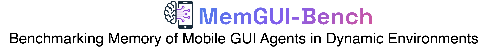
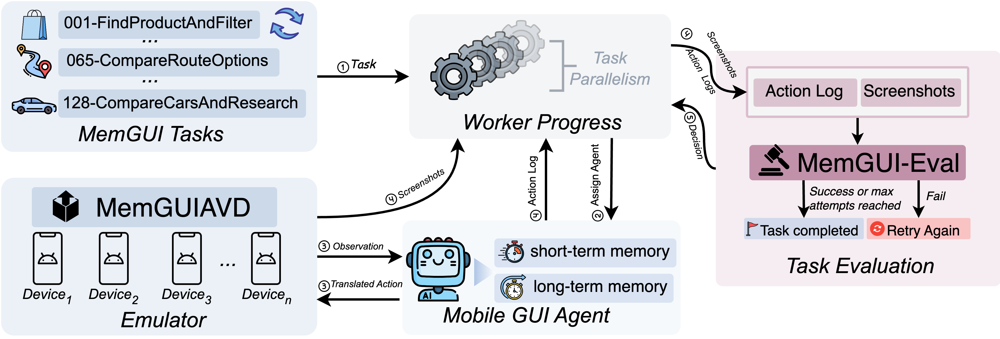
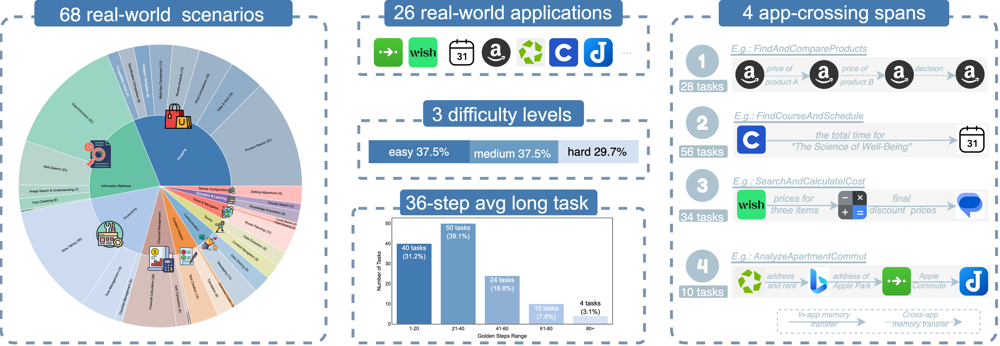

<div align="center">
  

<p>
    
    
    
    
    
    
    
  </p>

<p>
    <a href="https://arxiv.org/abs/2602.06075">
      
    </a>
    <a href="https://lgy0404.github.io/MemGUI-Bench/">
      
    </a>
    <a href="https://lgy0404.github.io/MemGUI-Bench/leaderboard.html">
      
    </a>
    <a href="https://huggingface.co/datasets/lgy0404/memgui-bench-trajs">
      
    </a>
  </p>
</div>

---

## 📋 Table of Contents

- [🐳 Environment Setup](#-environment-setup)
- [⚙️ Configuration](#️-configuration)
- [🚀 Usage](#-usage)
- [📁 Benchmark Session](#-benchmark-session)
- [📊 Metrics](#-metrics)
- [🤖 Adding a New Agent](#-adding-a-new-agent)
- [📤 Leaderboard Submission](#-leaderboard-submission)
- [📚 Dataset](#-dataset)
- [📝 Citation](#-citation)

---

## 🐳 Environment Setup

<div align="center">
  
</div>


### Option 1: Docker (Recommended)

Use our pre-configured Docker image with all dependencies installed:

```bash
# Pull the image (public, no login required)
sudo docker pull \
  crpi-6p9eo5da91i2tx5v.cn-hangzhou.personal.cr.aliyuncs.com/memgui/memgui-bench:26020301

# Run container
sudo docker run -it --privileged \
  --name memgui-bench \
  -w /root/MemGUI-Bench \
  crpi-6p9eo5da91i2tx5v.cn-hangzhou.personal.cr.aliyuncs.com/memgui/memgui-bench:26020301 \
  bash

# Inside container, you're already in /root/MemGUI-Bench
python run.py
```

> **Note**: The `--privileged` flag is required for Android emulator support.

The Docker image includes:

- Pre-configured Android emulator with MemGUI-AVD
- All required conda environments
- ADB and Android SDK tools

### Option 2: Local Setup

For developers who prefer local installation:

<details>
<summary><b>Click to expand local setup instructions</b></summary>

#### Prerequisites

1. **Conda**: Install from [conda.io](https://conda.io/projects/conda/en/latest/user-guide/install/index.html)
2. **Android Debug Bridge (ADB)**: Install from [Android Developer](https://developer.android.com/tools/adb) and add to PATH
3. **Android Studio & AVD**:
   - Download and install [Android Studio](https://developer.android.com/studio)
   - Download the pre-configured MemGUI-AVD emulator snapshot:
     - **Download**: [Baidu Netdisk](https://pan.baidu.com/s/11MhISCYTV5JJPjf9FALy2g?pwd=tfnb) (Code: `tfnb`)
     - **File**: `MemGUI-AVD-250704-base.zip`
   - Extract to your AVD directory:
     - **Windows**: `C:\Users\[Username]\.android\avd\`
     - **macOS**: `~/Library/Android/avd/`
     - **Linux**: `~/.android/avd/`
   - Launch Android Studio → Device Manager → Start MemGUI-AVD

#### Repository Setup

```bash
# Clone repository with submodules
git clone --recursive https://github.com/lgy0404/MemGUI-Bench.git
cd MemGUI-Bench

# If already cloned without --recursive, init submodules manually:
# git submodule update --init --recursive

# Run setup script
./setup.sh

# Configure
cp config.yaml.example.opensource config.yaml
# Edit config.yaml with your paths
```

</details>

---

## ⚙️ Configuration

Edit `config.yaml` to match your environment:

```yaml
# Environment Mode
ENVIRONMENT_MODE: "local"  # "local" or "docker"

# Experiment Settings
AGENT_NAME: "Qwen3VL"
DATASET_PATH: "./data/memgui-tasks-all.csv"
SESSION_ID_SUFFIX: "my-experiment"

# API & Parallelism
BASE_URL: "https://api.openai.com/v1"
NUM_OF_EMULATOR: 4
MAX_EVAL_SUBPROCESS: 8

# Model API Keys
QWEN_API_KEY: "your-api-key"
QWEN_MODEL: "qwen3-vl-8b"
```

<details>
<summary><b>Full configuration example (for local mode)</b></summary>

```yaml
# Part 1: Environment Mode
ENVIRONMENT_MODE: "local"  # "local" or "docker"

# Part 2: Experiment Settings
AGENT_NAME: "Qwen3VL"
DATASET_PATH: "./data/memgui-tasks-all.csv"
SESSION_ID_SUFFIX: "my-experiment"

# Part 3: API & Parallelism
BASE_URL: "https://api.openai.com/v1"
NUM_OF_EMULATOR: 4
MAX_EVAL_SUBPROCESS: 8

# Part 4: Model API Keys
QWEN_API_KEY: "your-api-key"
QWEN_MODEL: "qwen3-vl-8b"

# Part 5: Paths (for local mode)
_MODE_PRESETS:
  environment:
    local:
      _CONDA_PATH: "/path/to/miniconda3"
      _EMULATOR_PATH: "/path/to/android-sdk/emulator/emulator"
      _ANDROID_SDK_PATH: "/path/to/android-sdk"
      _SYS_AVD_HOME: "/path/to/.android/avd"
      _SOURCE_AVD_HOME: "/path/to/.android/avd"
```

</details>

---

## 🚀 Usage

### Running the Benchmark

```bash
conda activate MemGUI
python run.py
```

### Command-line Arguments

| Argument            | Default  | Description                                |
| ------------------- | -------- | ------------------------------------------ |
| `--agents`        | config   | Agent name(s), comma-separated             |
| `--mode`          | `full` | `full` (exec+eval) / `exec` / `eval` |
| `--session_id`    | config   | Session identifier for results             |
| `--task_id`       | None     | Run specific task only                     |
| `--max_attempts`  | 3        | Max attempts per task                      |
| `--overwrite`     | False    | Overwrite existing results                 |
| `--no_concurrent` | False    | Disable parallel evaluation                |

### Examples

```bash
# Full benchmark (execution + evaluation)
python run.py

# Run specific task
python run.py --task_id 001-FindProductAndFilter

# Evaluation only (on existing trajectories)
python run.py --mode eval --session_id my-experiment

# Multiple attempts
python run.py --max_attempts 5

# Disable parallel execution
python run.py --no_concurrent
```

---

## 📁 Benchmark Session

Each `session_id` creates an isolated benchmark folder in `./results/`.

- The dataset is copied to `results.csv` to track progress
- Re-running the same session resumes from incomplete tasks
- Results accumulate across runs

### Output Structure

<details>
<summary><b>Click to expand output directory structure</b></summary>

```
results/session-{session_id}/
├── results.csv                    # Aggregated execution & evaluation metrics
├── results.csv.lock               # File lock for concurrent access
├── metrics_summary.json           # Computed benchmark metrics
├── {agent_name}.json              # Leaderboard format (for submission)
├── config.yaml                    # Config snapshot for reproducibility
│
└── {task_id}/
    └── {agent_name}/
        └── attempt_{n}/
            ├── log.json                    # Execution log with actions
            ├── 0.png, 1.png, ...          # Raw screenshots per step
            ├── stdout.txt, stderr.txt     # Process output logs
            ├── error.json                 # Error info (if any)
            │
            ├── visualize_actions/         # Action visualization images
            │   └── step_1.png, step_2.png, ...
            │
            ├── single_actions/            # Individual action screenshots
            │   └── step_1.png, step_2.png, ...
            │
            ├── puzzle/                    # Evaluation puzzle images
            │   ├── puzzle.png
            │   ├── pre_eval_puzzle.png
            │   └── supplemental_puzzle.png (if needed)
            │
            ├── evaluation_summary.json    # Detailed evaluation results
            ├── final_decision.json        # Final evaluation decision
            ├── irr_analysis.json          # IRR evaluation results
            ├── badcase_analysis.json      # BadCase classification
            └── step_*_description.json    # Step-by-step analysis
```

</details>

---

## 📊 Metrics

The benchmark automatically computes:

| Metric               | Description                                  |
| -------------------- | -------------------------------------------- |
| **Pass@K**     | Success rate within K attempts               |
| **IRR**        | Information Retrieval Rate (memory accuracy) |
| **FRR**        | Failure Recovery Rate (learning from errors) |
| **MTPR**       | Memory Task Performance Ratio                |
| **Step Ratio** | Agent steps / Golden steps                   |
| **Time/Step**  | Average execution time per step              |
| **Cost/Step**  | API cost per step (if applicable)            |

Results are saved to `metrics_summary.json` and `{agent_name}.json` (leaderboard format).

---

## 🤖 Adding a New Agent

### Step 1: Add Config

Add your agent to `config.yaml`:

```yaml
AGENTS:
  - NAME: "MyAgent"
    REPO_PATH: "./framework/models/MyAgent"
    ENV_NAME: "my_agent_env"
```

### Step 2: Implement Agent Class

Create your agent class in `framework/agents.py`:

```python
class MyAgent(AndroidWorldAgent):
    agent_name = "MyAgent"
  
    def construct_command(self, task, full_task_description, output_dir, device):
        script = "run.py"
        args = f'--task "{full_task_description}" --output {output_dir} --device {device["serial"]}'
        return script, args
```

### Step 3: Output Format

Your agent must output:

- Screenshots: `0.png`, `1.png`, ... (one per step)
- Log file: `log.json` with execution summary

The benchmark handles evaluation automatically.

---

## 📤 Leaderboard Submission

After running the benchmark:

### 1. Submit Results JSON (Required)

Find `{agent_name}.json` in your session folder and fill in metadata:

```json
{
  "name": "YourAgent",
  "backbone": "GPT-4V",
  "type": "Agentic Workflow",
  "institution": "Your Institution",
  "date": "2026-02-03",
  "paperLink": "https://arxiv.org/...",
  "codeLink": "https://github.com/...",
  "hasUITree": true,
  "hasLongTermMemory": false
}
```

Submit via Pull Request to [lgy0404/MemGUI-Bench](https://github.com/lgy0404/MemGUI-Bench) → `docs/data/agents/`

### 2. Upload Trajectories (Optional but Recommended)

Compress and submit via PR to [lgy0404/memgui-bench-trajs](https://huggingface.co/datasets/lgy0404/memgui-bench-trajs):

```bash
# Compress session folder
cd results && zip -r your-agent-name.zip session-{id}

# Upload via HuggingFace Web UI:
# 1. Go to https://huggingface.co/datasets/lgy0404/memgui-bench-trajs
# 2. Click "Community" → "New Pull Request" → "Upload files"
# 3. Upload your zip file and submit the PR
```

See [submission guide](https://lgy0404.github.io/MemGUI-Bench/submission.html) for details.

---

## 📚Tasks

<div align="left">
  
</div>

<table>
  <thead>
    <tr>
      <th>File</th>
      <th>Tasks</th>
      <th>Description</th>
    </tr>
  </thead>
  <tbody>
    <tr>
      <td><code>memgui-tasks-all.csv</code></td>
      <td align="center">128</td>
      <td>Full benchmark</td>
    </tr>
    <tr>
      <td><code>memgui-tasks-40.csv</code></td>
      <td align="center">40</td>
      <td>Subset for quick testing</td>
    </tr>
  </tbody>
</table>

<details>
  <summary><strong>Task Fields</strong> (click to expand)</summary>

<ul>
    <li><code>task_identifier</code></li>
    <li><code>task_description</code></li>
    <li><code>task_app</code></li>
    <li><code>num_apps</code></li>
    <li><code>requires_ui_memory</code></li>
    <li><code>task_difficulty</code></li>
    <li><code>golden_steps</code></li>
  </ul>

</details>

---

## 📝 Citation

```bibtex
@misc{liu2026memguibenchbenchmarkingmemorymobile,
  title={MemGUI-Bench: Benchmarking Memory of Mobile GUI Agents in Dynamic Environments},
  author={Guangyi Liu and Pengxiang Zhao and Yaozhen Liang and Qinyi Luo and Shunye Tang and Yuxiang Chai and Weifeng Lin and Han Xiao and WenHao Wang and Siheng Chen and Zhengxi Lu and Gao Wu and Hao Wang and Liang Liu and Yong Liu},
  year={2026},
  eprint={2602.06075},
  archivePrefix={arXiv},
  primaryClass={cs.DC},
  url={https://arxiv.org/abs/2602.06075},
}
```

---

## 📄 License

[MIT License](LICENSE)
